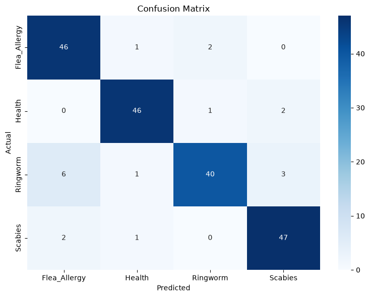
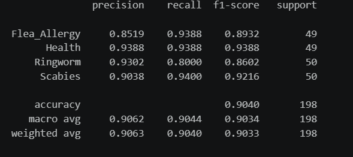
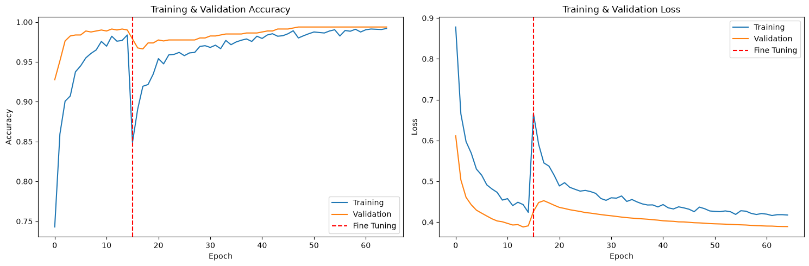
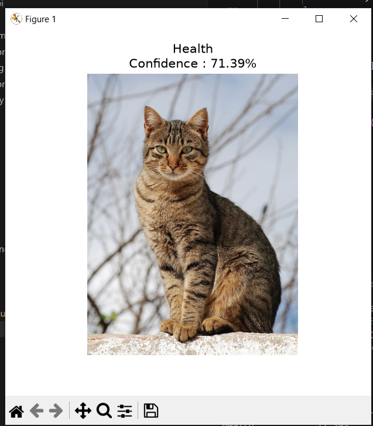
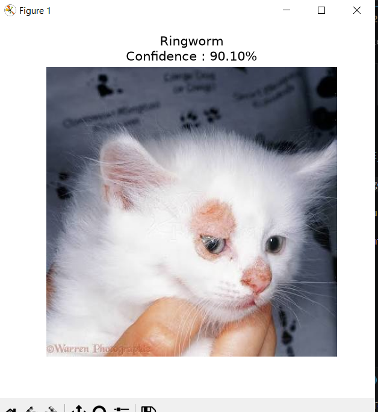
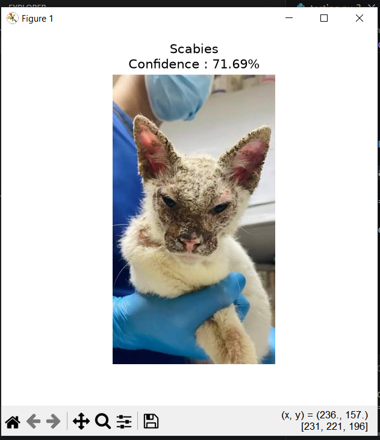

# 🐱 Cat Skin Disease Detection using EfficientNetB0

Repository ini berisi proses penelitian dan pengembangan model **Deep Learning** untuk mendeteksi penyakit kulit pada kucing menggunakan arsitektur **EfficientNetB0**.

Project ini merupakan bagian dari penelitian skripsi yang mencakup seluruh tahapan machine learning, mulai dari persiapan dataset, preprocessing, augmentasi data, pelatihan model, evaluasi performa, hingga menghasilkan model akhir (`.keras`) yang siap digunakan oleh backend API.

> **Disclaimer**
>
> Model ini hanya digunakan sebagai alat bantu identifikasi awal dan **bukan pengganti diagnosis dokter hewan**.

---

# 📌 Latar Belakang

Penyakit kulit pada kucing merupakan salah satu masalah kesehatan yang cukup sering terjadi dan memiliki gejala visual yang mirip antar penyakit. Hal tersebut dapat menyebabkan keterlambatan dalam melakukan penanganan yang tepat.

Penelitian ini bertujuan membangun model klasifikasi citra berbasis Deep Learning yang mampu membantu proses identifikasi awal penyakit kulit pada kucing secara otomatis menggunakan arsitektur **EfficientNetB0**.

---

# 🎯 Tujuan Penelitian

- Mengembangkan model klasifikasi penyakit kulit pada kucing menggunakan EfficientNetB0.
- Melakukan preprocessing dan augmentasi dataset untuk meningkatkan kualitas data pelatihan.
- Mengevaluasi performa model menggunakan berbagai metrik evaluasi.
- Menghasilkan model Deep Learning yang siap digunakan pada aplikasi berbasis REST API.

---

# 📚 Dataset

Dataset yang digunakan berasal dari Kaggle.

**Dataset**

> Cat Skin Disease Dataset

**Sumber Dataset**
https://www.kaggle.com/datasets/nofalrafif/cat-skin-disease

Dataset terdiri dari empat kelas:

| Kelas        |
| ------------ |
| Healthy      |
| Ringworm     |
| Scabies      |
| Flea Allergy |

---

# 🔄 Pipeline Machine Learning

```text
Dataset Kaggle
        │
        ▼
Data Cleaning
        │
        ▼
Train-Test Split (80 : 20)
        │
        ├──────────────┐
        ▼              ▼
     Train            Test
        │
        ▼
Offline Data Augmentation
        │
        ▼
Validation Split
        │
        ▼
EfficientNetB0
        │
        ▼
Stage 1
(Feature Extraction)
        │
        ▼
Stage 2
(Fine-Tuning)
        │
        ▼
Evaluation
        │
        ▼
Final Model (.keras)
```

---

# 🩺 Kelas Penyakit

Model mampu mengklasifikasikan empat kategori penyakit.

| Label        | Deskripsi                       |
| ------------ | ------------------------------- |
| Healthy      | Kucing dalam kondisi sehat      |
| Ringworm     | Infeksi jamur (Dermatophytosis) |
| Scabies      | Infestasi tungau penyebab kudis |
| Flea Allergy | Alergi akibat gigitan kutu      |

---

# 🛠️ Tech Stack

## Machine Learning

- Python
- TensorFlow / Keras
- EfficientNetB0
- NumPy
- OpenCV
- Pillow
- Scikit-Learn

## Tools

- Jupyter Notebook
- Visual Studio Code
- Git
- GitHub

---

# 📂 Struktur Repository

```text
cat-skin-disease-research/

├── dataset/
│   ├── train/
│   ├── train_augmented/
│   └── test/
│
├── models/
│   ├── stage1_best.keras
│   ├── stage2_best.keras
│   └── cat_skin_efficientnetb0.keras
│
├── notebooks/
│   └── skin_disease_cat.ipynb
│
├── result/
│   ├── classification_report.png
│   ├── confusion_matrix.png
│   ├── history_stage1.pkl
│   ├── history_stage2.pkl
│   └── training_curve.png
│
├── README.md
└── requirements.txt
```

---

# 🤖 Model Output

Hasil pelatihan menghasilkan tiga model:

| Model                         | Keterangan                                  |
| ----------------------------- | ------------------------------------------- |
| stage1_best.keras             | Model terbaik pada tahap Feature Extraction |
| stage2_best.keras             | Model terbaik pada tahap Fine-Tuning        |
| cat_skin_efficientnetb0.keras | Model final yang digunakan pada backend API |

---

# 📈 Hasil Evaluasi

### Confusion Matrix



---

### Classification Report



---

### Training Curve



File evaluasi lengkap tersedia pada folder:

```text
result/
```

---

# Prediction example





---

# 🚀 Penggunaan Model

Model hasil penelitian ini digunakan sebagai model inferensi pada repository berikut:

> **Cat Skin Disease API**

Repository backend akan memanfaatkan file:

```text
models/cat_skin_efficientnetb0.keras
```

untuk melakukan prediksi gambar melalui REST API.

---
